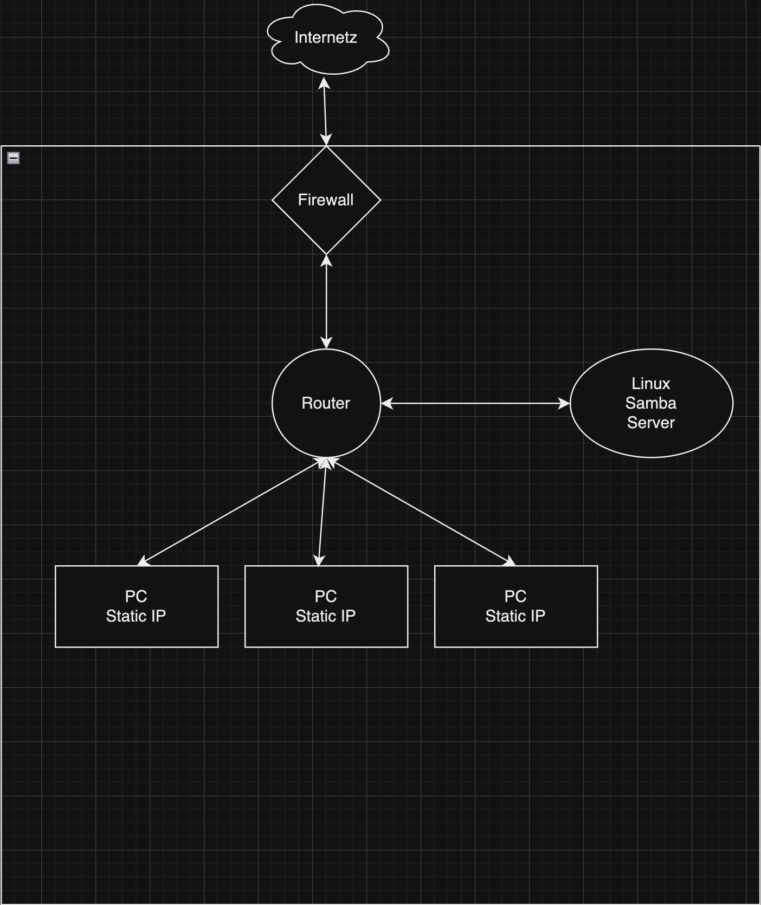

### Devs

- [Andrew Carroll](https://github.com/iAmAndrewCarroll)
- [Bryanna Fox](https://github.com/BryannaKFox)
- [Renona Gay](https://github.com/Foodisthebest)
- [Will Baur](https://github.com/Wrbaur/Wrbaur)
- [Malena Tomlin](https://github.com/mtcf987)

## Scenario

**A tiny new space startup looking to build and deploy micro-satellites.**
- The company has mostly been hardware and software engineers working out of a large converted garage space.
- They have received some grants and some investments, and they want to expand to hire more engineers, but also a few non-technical employees such as an office manager, a media person, etc.
- Most employees will continue to work out of a central location, but both technical and non-technical users will sometimes need to travel.
- Information security is a priority: The company's only value is its intellectual property. The company is unwilling to allow these technical designs to be stored on the cloud, and does not want any of it's intellectual property to leave the building (except in the form of offsite backups).

### System Selection

- Samba Fileshare
  - Why: Samba is a scalable fileshare solution that will serve our clients needs now and in the future.

- Remote Access via Microsoft Remote Desktop
  - Why: Microsoft Remote Desktop is a secure and easy to use remote access solution.  This is also scalable and will serve our clients needs now and in the future.

- Windows Defender - Data Security
  - Why: To ensure the IP is not compromised and ease of use for our clients.  

- Thunderbird Email Client
  - Why: Thunderbird is a secure and easy to use email client.  This is also scalable and will serve our clients needs now and in the future.

- Scalability
  - Why: The system is designed to scale easily as the company is poised for rapid expansion.

- Hardware

  - Why: The hardware is designed to provide the highest level of security and productivity for all users.

- User Roles
  - User access is determined by their designation within the company.  Least Privilege Access model.

### MVP

We will provide the client with a secure network that will allow for the highest level of productivity and security for all users.  The network will be designed to scale easily as the company is poised for rapid expansion.