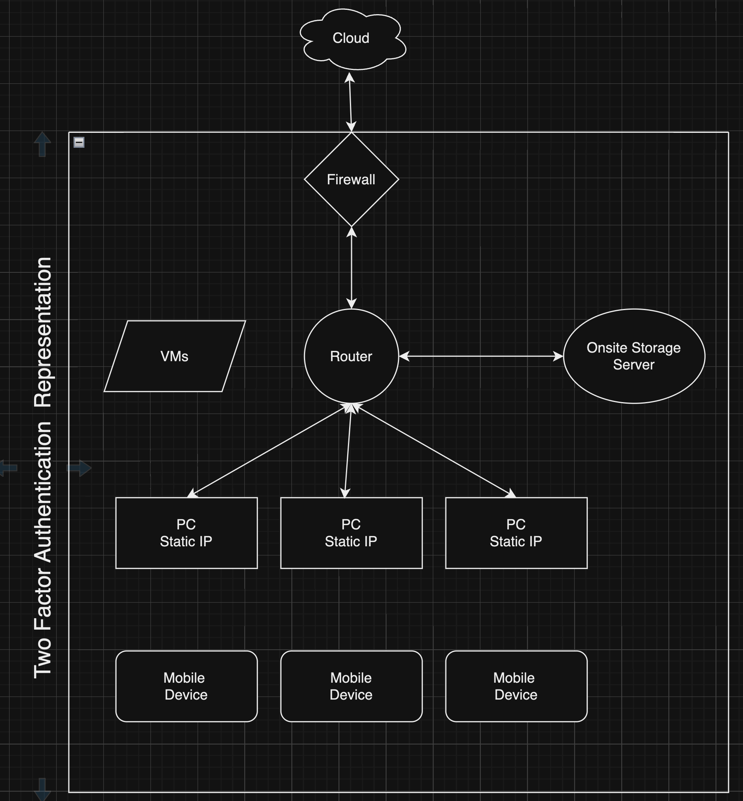

### Devs

- [Andrew Carroll](https://github.com/iAmAndrewCarroll)
- [Bryanna Fox](https://github.com/BryannaKFox)
- [Renona Gay](https://github.com/Foodisthebest)
- [Will Baur](https://github.com/Wrbaur/Wrbaur)
- [Malena Tomlin](https://github.com/mtcf987)

## Scenario

**A tiny new space startup looking to build and deploy micro-satellites.**
- The company has mostly been hardware and software engineers working out of a large converted garage space.
- They have received some grants and some investments, and they want to expand to hire more engineers, but also a few non-technical employees such as an office manager, a media person, etc.
- Most employees will continue to work out of a central location, but both technical and non-technical users will sometimes need to travel.
- Information security is a priority: The company's only value is its intellectual property. The company is unwilling to allow these technical designs to be stored on the cloud, and does not want any it's intellectual property to leave the building (except in the form of offsite backups).

### System Selection

- 2 Factor Authentication
  - [Yubikey](https://www.yubico.com/)
  - [Google Authenticator](https://play.google.com/store/apps/details?id=com.google.android.apps.authenticator2&hl=en_US)
  - [Authy](https://authy.com/)
  - Other options
  - Why: In order to safeguard the clients IP we need to ensure only authorized users can gain access to the network and assets.  Two Factor ensures the highest level of security at this time.

- VPN
  - Why: Provide a secure tunnel for remote users to access the network and assets.

- Data Security
  - All data remains on company premises
  - Why: To ensure the IP is not compromised by being stored on the cloud.  The only offsite storage is kept at our facility as a back-up and is offline unless backups are being conducted.

- Connectivity Speed
  - A well designed local network ensures the fastest possible speeds for all users.
  - Why: To ensure the highest level of productivity for all users.

- Scalability
  - Why: The system is designed to scale easily as the company is poised for rapid expansion.

- Intrusion Prevention
  - Why: Security measures such as firewalls and intrusion detection systems are in place to ensure the highest level of security for the network and assets.

- VM
  - Why: VMs provide a secure and isolated environment for accessing data.  Each user can have a dedicated VM that can access the onsite storage and network.

- Hardware

  - Why: The hardware is designed to provide the highest level of security and productivity for all users.

- User Roles
  - User access is determined by their designation within the company.  Least Privilege Access model...probably.

### MVP

We will provide the client with a secure network that will allow for the highest level of productivity and security for all users.  The network will be designed to scale easily as the company is poised for rapid expansion.